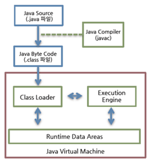
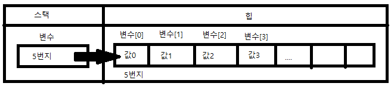
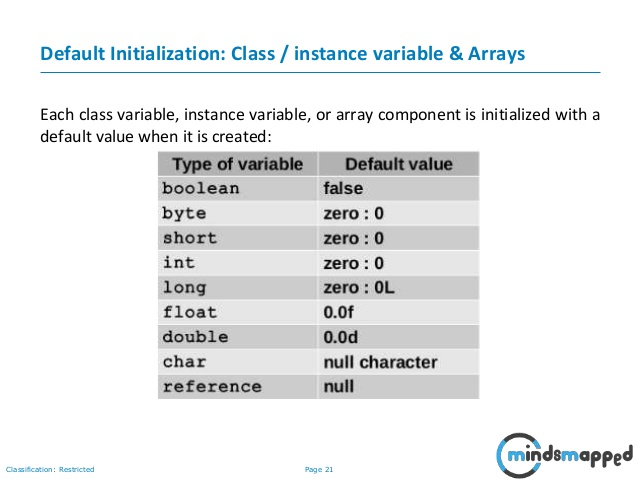
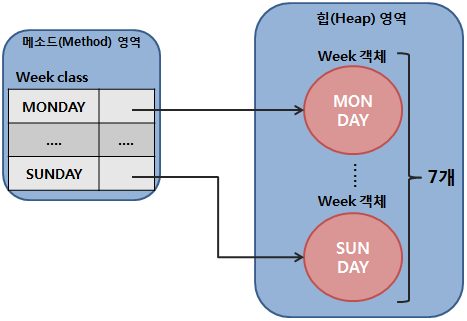
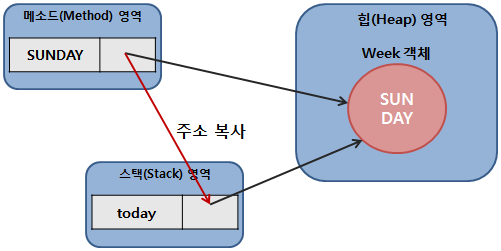
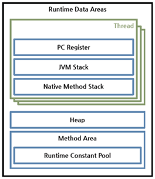
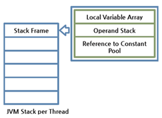

# Java Study
이 저장소의 목적은 자바를 공부하면서 남들에게 쉽게 설명할 수 있을때까지 유지, 보수 하면서 만들어 나가는 것입니다.<br/>

## 목차
1. [JVM](https://github.com/irerin07/java_study#01-jvm-%EC%9E%90%EB%B0%94-%EA%B0%80%EC%83%81-%EB%A8%B8%EC%8B%A0)
2. [참조 타입](https://github.com/irerin07/java_study#02-%EC%B0%B8%EC%A1%B0-%ED%83%80%EC%9E%85)
3. [메모리 영역](https://github.com/irerin07/java_study/blob/master/README.md#03-%EB%A9%94%EB%AA%A8%EB%A6%AC-%EC%98%81%EC%97%AD)
4. [클래스](https://github.com/irerin07/java_study/blob/master/README.md#04-%ED%81%B4%EB%9E%98%EC%8A%A4)

## 01 JVM 자바 가상 머신
자바 프로그램은 완전한 기계어가 아닌, 중간 단계의 바이트 코드라 이를 해석하고 실행해 줄 가상의 운영체제가 필요하다.<br/>
이 역할을 수행하는 것이 JVM.<br/>
바이트 코드는 모든 운영체제에 상관없이 언제나 같은 실행결과를 보장하지만 JVM은 운영체제에 종속적이므로 운영체제에 맞는 JVM을 설치해야한다.<br/>
JVM은 JDK혹은 JRE를 설치하면 자동으로 설치된다.
#### JDK: Java Development Kit
- 자바 프로그램 개발시 필요한 도구(javac, java등)들을 포함
- JDK를 설치하면 JRE도 같이 설치가 된다.
#### JRE: Java Runtime Environment
- 컴파일된 자바 프로그램을 실행시킬 수 있는 자바 환경
- JVM이 자바 프로그램을 동작시킬 때 필요한 라이브러리 파일들과 기타 파일들을 가지고 있다.
- 자바 프로그램을 실행시키기 위해서는 필수로 설치되어야 한다. <br/>


확장자가 .java인 소스 파일을 컴파일러(javac.exe)로 컴파일하여 확장자가 .class인 바이트 코드 파일을 생성한다.<br/>
생성된 바이트 코드 파일은 jvm 구동 명령어(java.exe)를 통해 JVM에서 해석되고 운영체제에 맞게 기계어로 번역이 된다.<br/>
Class Loader가 컴파일 된 자바 바이트 코드를 런타임 데이터 영역에 로드하고, 실행 엔진이 자바 바이트 코드를 실행한다.<br/>
자바의 가장 큰 장점은 한 번 작성하면 어디에서나 실행이 된다(Write Once, Run Everywhere)는 점이지만<br/>
JVM을 한 번 거쳐 기계어로 번역되고 실행되기 때문에 C, C++과 같은 언어들보다 속도가 느리다는 단점이 있다.<br/>
다만 JVM 내부의 최적화된 JIT컴파일러를 통해 속도의 격차는 많이 줄어들고 있다.
#### JIT: Just-In-Time compilation), 동적 번역
- 프로그램을 실제 실행하는 시점에 기계어로 번역하는 컴파일 기법
- Java에서는 바이트코드를 기계어로 번역할 때 사용된다.
- JIT 컴파일러는 같은 코드를 매번 해석하지 않고 실행할 때 컴파일을 하면서 해당 코드를 캐싱한다. 이후엔, 바뀐 부분만 컴파일 하고 나머지는 캐싱된 코드를 사용한다.<br/>

[맨위로](https://github.com/irerin07/java_study#java-study)

## 02 참조 타입
참조타입인 배열, 열거, 클래스, 인터페이스를 이용해서 선언된 변수는 메모리의 주소를 값으로 갖게된다.<br/>
이 주소를 통해 객체를 참조한다는 뜻에서 참조 타입이라고 부른다.<br/>
```
String name = "Mike";
```
String클래스 변수인 name은 힙 영역의 String 객체 주소 값을 가지고 있고 이 주소를 통해 객체를 참조하기때문에 String 클래스 변수를 참조 타입 변수라 한다.

### 참조 변수의 ==, != 연산
참조 타입 변수들 간 ==, != 연산은 동일한 객체를 참조하는지 알아볼 때 사용된다.
참조 타입 변수는 힙 영역의 객체 주소이므로 주소값을 비교한다.
동일한 객체를 참조하는 경우 == 연산은 true를 반환하고 != 연산은 false를 반환한다.

### Null, NullPointerException
참조 타입의 변수는 아무런 객체를 참조하지 않는다는 뜻으로 null값을 가질 수 있다.
null 값도 초기값으로 사용할 수 있어서 null로 초기화 된 참조 변수는 스택 영역에 생성된다.
참조 타입의 변수가 null을 가지는 경우에는 아무런 객체도 참조하지 않고 있으므로 사용할 수 없다.
하지만 실수로 null값을 가지고 있는 참조 타입 변수를 사용하면 NullPointerException이 발생한다.

### String 타입
- 자바는 문자열을 String 변수에 저장한다.
    * 조금 더 정확히 말하자면 문자열은 String 객체로 생성되고 변수는 String 객체를 참조한다.
```
String name = "Mike";
String hobby;
hobby = "singing";
```
- 위 코드에서 name 변수와 hobby 변수는 스택 영역에 생성이 되고 문자열 리터럴 "Mike"와 "singing"은 힙 영역에 String 객체로 생성되고<br/>
name변수와 hobby변수에 String 객체의 주소값이 저장된다.

```
String name1 = "Tom";
String name2 = "Tom";
```
- 위와 같이 name1과 name2 변수가 동일한 문자열을 참조하는 경우 두 변수는 동일한 String객체를 참조한다.
- 하지만 new 연산자를 사용해 새로운 객체를 만들면 서로 다른 String객체를 참조하게 된다.
- 문자열만을 비교하고자 할때는 ==연산이 아니라 .equals() 메서드를 사용한다.
```
Boolean res = name1.equals(name2);
```
- String 변수는 참조 타입이므로 초기값에 null을 대입할 수 있다.

### 배열 타입
- 저장할 데이터가 많은 경우 각각의 데이터마다 변수를 지정해 주는 것은 굉장히 비효율적이다.
    - 예를들어 학생 50명의 데이터를 저장하기 위해 50개의 변수를 선언하는것은 그리 좋은 방법은 아닐것이다.
- 배열은 같은 타입의 데이터를 연속된 공간에 나열시키고 각 데이터에 인덱스를 부여한 자료구조이다.

#### 배열 선언
```
타입[] 변수;
타입 변수[];
```
- 대괄호[] 는 배열 변수를 선언하는 기호
- 타입은 배열에 저장될 데이터의 타입을 말한다.(int, double, String...)
- 배열 역시 객체이기에 힙 영역에 생성되고 배열 변수는 힙 영역의 배열 객체를 참조한다.
- 참조할 배열 객체가 없다면 null값으로 초기화 할 수 있다.

#### 값 목록으로 배열 생성
```
데이터타입[] 변수 = {값0, 값1, 값2, ...};
```

- 중괄호{}는 주어진 값들을 항목으로 가지는 배열 객체를 힙에 생성, 배열 객체의 번지를 리턴한다.
- 배열 변수는 리턴된 번지를 저장함으로써 참조가 이루어진다.

```
타입[] 변수;
변수 = {값0, 값1, 값2, 값3,...}; //컴파일 에러
```
- 배열 변수를 선언한 다음 다른 실행문에서 중괄호를 사용한 배열 생성은 허용되지 않는다.
- 먼저 변수를 선언한 뒤에 나중에 배열을 생성해야 한다면 new 연산자를 사용해야한다.
```
타입[] 변수;
변수 = new 타입[] {값0, 값1, 값2, 값3, ...};
```
- 메소드의 매개값이 배열일 경우도 마찬가지
```
public class main.java.study.referencetype.ArrayExample2 {
    public static void main(String[] args) {
        int[] scores;
        scores = new int[] {34,36,37,86};
        int sum1 = 0;
        for(int i = 0; i < scores.length; i++){
            sum1 += scores[i];
        }
        System.out.println(sum1);
        int sum2 = add(new int[] {34,36,37,86});
//        int sum2 = add(scores);
        System.out.println(sum2);
    }
    public static int add(int[] arrays){
        int sum = 0;
        for(int i = 0; i < arrays.length; i++){
            sum += arrays[i];
        }
        return sum;
    }
}

```
- new 연산자를 사용하여 나중에 값을 저장할 배열을 미리 만들 수 있다.
```
타입[] 변수 = new 타입[길이];
int[] array = new int[5]; //길이가 5인 int배열 생성. 기본값은 0
```
- new연산자로 배열을 처음 생성하면 자동적으로 기본값으로 생성이 된다.


#### 배열의 길이
- 배열에 저장할 수 있는 전체 항목 수
```
배열변수.length;
```
length는 읽기 전용 필드이며 값을 바꿀 수 없다.

#### 커맨드 라인 입력
```
public static void main(String[] args){

}
```
- 프로그램을 실행하기 위해 필요한 main()메서드의 매개값인 String[] args
```
javac 컴파일할 자바 파일.java
java 클래스파일
``` 
터미널을 통해 위와 같이 자바 프로그램을 실행 하면 JVM은 길이가 0인 String 배열을 먼저 생성하고 main()메소드를 호출할 때 매개값으로 전달한다.

```
public class Test {
  	public static void main(String[] args) {
  		for(String str : args) {
			System.out.println(str);
		}
  	}
}

```
- 위의 코드를 작성 후
```
javac Test.java
java Test this is a test
```
- 위의 코드를 터미널에서 실행하면 다음과 같은 결과가 나온다.
```
this
is
a
test.
```
- main()메소드는 String[] args 매개변수를 통해 커맨드 라인에서 입력된 데이터의 수(길이)와 입력된 데이터(배열의 항목 값)를 알 수 있게된다.

#### 다차원 배열
- 일반적인 값의 목록으로 구성된 1차원 배열과는 달리 값들이 행과 열로 구성된 배열을 2차원 배열이라 한다.

```
int[][] arrays = new int[2][3] // 2 X 3 배열을 생성한다.
arrays.length // 2 배열 A의 길이
arrays[0].length // 3 배열 B의 길이
arrays[1].length // 3 배열 C의 길이
```

- 1차원 배열을 이용해 2차원 배열을 구현하기 때문에 계단식 구조를 가질 수 있다.
```
int[][] arrays = new int[2][];
arrays[0] = new int[2]; 0,1
arrays[1] = new int[3]; 0,1,2

arrays.length // 2 배열 A의 길이
arrays[0].length // 2 배열 B의 길이
arrays[1].length // 3 배열 C의 길이
```
- 이런 형태의 배열에서는 항상 배열의 정확한 길이를 알고 사용해야 한다.
- 만약 존재하지 않는 배열의 인덱스를 사용하면 ArrayIndexOutOfBoundException을 발생시킨다.

#### 객체를 참조하는 배열
- 참조타입 배열(클래스, 인터페이스)은 각 항목에 주소를 가지고 있다. 즉 객체를 참조하는것이다.

#### 배열복사
- 배열은 한 번 생성하면 크기를 변경할 수 없다.
- 만약 더 큰 저장 공간이 필요하다면 크기가 더 큰 배열을 만들어 이전 배열을 복사해야한다.
- for loop를 사용할 수도 있고, System.arraycopy()를 사용할 수도 있다.
```
public class main.java.study.referencetype.ArrayExample3 {
    public static void main(String[] args) {
        int[] array1 = {1,2,3};
        int[] array2 = new int[5];
        int[] array3 = new int[5];

        for(int i = 0; i < array1.length; i++){
            array2[i] = array1[i];
        }

        for(int i = 0; i < array2.length; i++){
            System.out.print(array2[i]);
        }

        System.arraycopy(array1, 0, array3, 0, array1.length);
        //System.arraycopy(원본배열, 원본배열에서 복사를 시작할 인덱스, 붙여넣을 배열, 새 배열에서 붙여넣을 시작 인덱스)
        System.out.println();
        for(int i = 0; i < array3.length; i++){
            System.out.print(array3[i]);
        }
    }
}

```

#### for loop
```
for(타입변수 : 배열){
    실행문
}
```

1. for 문이 처음 실행될 때 배열에서 가져올 첫번째 값이 있는지 확인한다.<br/>
2. 존재한다면 해당 값을 타입변수에 저장하고 실행문을 실행한다.<br/>
3. 실행문이 모두 완료되면 다시 루프를 돌아 배열에서 다음 값이 있는지 확인하고 값이 없다면 종료되고 값이 있다면 2로 돌아간다.<br/>
```
public class main.java.study.referencetype.ArrayExample4 {
    public static void main(String[] args) {
        int[] array = {1,2,3,4,5,6};
        String[] array2 = {"a","b", "c", "d", "e"};
        for(int a:array){
            System.out.println(a);
        }
        for(String b:array2){
            System.out.println(b);
        }
    }
}
```
### 열거 타입
- 한정된 값만을 갖는 데이터 타입 (enumeration type)
- 주어진 몇가지의 열거 상수 중에서 하나의 상수를 저장하는 데이터 타입.

#### 열거 타입의 선언
- 열거 타입의 이름으로 소스 파일을 생성한다.
- 소스파일의 내용은 다음과 같다.
```
public enum WEEK{
    MONDAY,
    TUESDAY,
    WEDNESDAY,
    THURSDAY,
    FRIDAY,
    SATURDAY,
    SUNDAY
}
```
#### 열거 타입 변수
```
열거타입 변수;
Week today;
Week reservationDay;
```
- 열거 타입 변수를 선언하면 열거 상수를 저장할 수 있다.
- 열거 상수는 단독으로 사용불가
```
열거타입 변수 = 열거타입.열거상수;
Week today = Week.SUNDAY;
Week birthday = null;
```
- 참조 타입의 변수는 객체를 참조하는 변수다 -> 열거 상수 역시 객체다.

- 월요일부터 일요일까지의 열거 상수는 다음과 같이 총 7개의 Week로 생성된다.
- 메소드 영역에 생성된 열거 상수가 해당 Week를 각각 참조한다.


```
Week today = Week.SUNDAY;
```
- 열거타입 변수 today는 스택 영역에 생성된다.
- today에 저장되는 값은 Week.SUNDAY 열거 상수가 참조하는 객체의 주소
- 열거상수 Week.SUNDAY와 변수 today는 서로 같은 Week 객체를 참조

#### 열거 객체의 메소드
- 열거 객체는 열거 상수의 문자열을 내부 데이터로 가지고 있다.
- 모든 열거 타입은 Enum 클래스를 상속받기에 Enum클래스에 선언된 메소드들을 사용할 수 있다.

##### name()메소드
- 열거 객체의 문자열을 반환한다.
- 반환되는 문자열은 열거 타입을 정의할 때 사용한 상수 이름과 같다.
```
Week today = Week.SUNDAY;
String name = today.name(); //SUNDAY를 반환
```
##### ordinal() 메소드
- 열거 객체의 0부터 시작하는 순번을 반환한다.
- 전체 열거 객체 중 몇 번째인지 알려준다.
```
Week today = Week.SUNDAY;
int ordinal = today.ordinal(); // 6을 반환
```

##### compareTo() 메소드
- 열거 객체를 비교해서 순번 차이를 반환
- 매개 값으로 주어진 열거 객체를 기준으로 전후로 몇 번쨰 위치하는지 비교한다.
```
Week day1 = Week.Monday;
Week day2 = Week.Wednesday;
int result1 = day1.compareTo(day2); //-2
int result2 = da2.compareTo(day1); //2
```
- 매개 값으로 주어진 열거 객채보다 순번이 빠르면 음수, 순번이 늦으면 양수를 반환한다.
- 위의 예제에서는 day1이 day2 보다 앞에 위치하므로 result1은 음수를, result2를 양수를 반환한다.

##### valueOf(String name)메소드
- 주어진 문자열의 열거 객체를 반환
- 매개값으로 주어진 문자열과 동일한 열거 객체를 반환
```
Week weekDay - Week.valueOf("SATURDAY");
```
##### values() 메소드
- 모든 열거 객체들을 배열로 반환
```
Week[] days = Week.values();
for(Week day: days){
    System.out.println(day);
}

//MONDAY
//TUESDAY
//WEDNESDAY
//THURSDAY
//FRIDAY
//SATURDAY
//SUNDAY
```
- 배열의 인덱스는 열거 객체의 순번과 같고 각 인덱스 값은 해당 순번의 열거 객체의 주소이다.


[맨위로](https://github.com/irerin07/java_study#java-study)

## 03 메모리 영역
<br/>
- java.exe로 JVM이 시작되면 JVM은 운영체제에서 할당받은 메모리 영역을 위와 같은 세부 영역으로 구분해서 사용한다.<br/>
- Pc Register, JVM Stack, Native Method Stack은 스레드 마다 하나씩 생성되고 Heap, Method Area, 런타임 상수 풀은 모든 스레드가 공유해서 사용한다.<br/>
---
### 메소드 영역 Method Area
- 코드에서 사용되는 클래스(~.class)들을 클래스 로더로 읽어 클래스별로 런타임 상수 풀, 필드 데이터, 메소드 데이터, 메소드 코드, 생성자 코드 등을 분류해서 저장한다.
- JVM이 시작할 때 생성된다.
#### 클래스 로더
- 자바는 런타임에 클래스를 처음 참조 시 해당 클래스를 로드하고 링크하는데(동적 로드) 이 동적로드를 담당하는 부분이 JVM의 Class Loader 
- Bootstrap Class Loader: Object 클래스 혹은 기본 Java API등을 로드
- Extension Class Loader: 기본 java API등을 제외한 확장 클래스들을 로드
- System Class Loader: 사용자가 지정한 $CLASSPATH 내의 클래스들을 로드
- User Defined Class Loader: 사용자가 직접 코드상에서 생성해 사용하는 Class Loader
  
Class Loader가 아직 로드되지 않은 클래스를 찾으면 위와 같은 과정을 거쳐 클래스를 로드하고 링크한뒤 초기화 한다.<br/>
- Loading – 클래스를 파일에서 가져와 JVM의 메모리에 업로드 한다.
- Verifying – 읽어 들인 클래스가 자바 언어 명세(Java Language Specification) 및 JVM명세에 명시된 대로 잘 구성되어 있는지 검사한다.
- Preparing – 클래스가 필요로 하는 메모리를 할당, 클래스에서 정의된 필드, 메서드, 인터페이스들을 나타내는 데이터 구조를 준비한다.
- Resolving – 클래스의 상수 풀 내 모든 심볼릭 레퍼런스를 다이렉트 레퍼런스로 변경한다.
   * 심볼릭 레퍼런스 -  객체를 가져오기 위해 사용되는 문자열
- Initializing – 클래스 변수들을 적절한 값으로 초기화. Static Initializer들을 수행하고 static 필드들을 설정된 값으로 초기화 한다.  
---
### 힙영역
- 객체와 배열이 생성되는 영역.
- 이곳에 생성된 객체와 배열은 JVM의 스택 영역의 변수나 다른 객체의 필드에서 참조한다.
- 참조하는 변수나 필드가 없다면 객체로서의 의미가 없기 때문에 JVM은 이를 Garbage Collector를 실행시켜 힙 영역에서 자동으로 제거한다.
 
### JVM Stack 영역
- 각 스레드마다 하나씩 존재하고, 스레드가 시작될 때 할당된다.
- 프로그램에서 추가적으로 스레드를 생성하지 않았다면 main 스레드만 존재하므로 JVM스택 역시 하나만 존재한다.
- Stack Frame이라는 구조체를 저장하는 스택
- JVM은 메소드를 호출할 때마다 JVM스택에 Stack Frame을 추가(Push)하고 메소드가 종료되면 해당 프레임을 제거(Pop)하는 동작만 수행
- Stack Trace의 각 라인은 하나의 스택 프레임을 표현한다.


#### Local Variable Array: 지역변수 배열
- 0부터 시작하는 인덱스를 가진 배열
- 0은 메서드가 속한 클래스 인스턴스의 this 레퍼런스
- 1부터는 메서드에 전달된 파라미터들이 저장된다.
- 그 이후로는 메서드의 지역 변수들이 저장된다.
#### Operand Stack: 피연산자 스택
- 메서드의 실제 작업 공간
- 각 메서드는 피연산자 스택과 지역 변수 배열 사이에서 데이터를 교환하고, 다른 메서드 호출 결과를 추가하거나(push) 꺼낸다(pop).
- 피연산자 스택 공간이 얼마나 필요한지는 컴파일할 때 결정할 수 있으므로, 피연산자 스택의 크기도 컴파일 시에 결정된다.
#### Reference to Constant Pool: 현재 실행 중인 메서드가 속한 클래스의 런타임 상수 풀에 대한 레퍼런스
- 런타임 상수 풀: 클래스 파일 포맷에서 constant_pool 테이블에 해당하는 영역이며 JVM 동작에서 가장 핵심적인 역할을 수행하는 곳
    * 각 클래스와 인터페이스의 상수뿐만 아니라, 메서드와 필드에 대한 모든 레퍼런스까지 담고 있는 테이블
    * 즉, 어떤 메서드나 필드를 참조할 때 JVM은 런타임 상수 풀을 통해 해당 메서드나 필드의 실제 메모리상 주소를 찾아서 참조한다. 

[맨위로](https://github.com/irerin07/java_study#java-study)

## 04 클래스

### 객체 지향 프로그래밍 Object Oriented Programming OOP
- 부품에 해당하는 객체를 먼저 만들고, 이 객체들을 조합해서 완성된 프로그램을 만드는 기법
#### 객체
- 실제로 존재하거나 추상적으로 생각할 수 있는 것들 중에서 자신의 속성을 가지고 있고 다른 것들과 식별이 가능한 것
    * 실제로 존재하는 사람, 자동차, 책....
    * 물리적으로 존재하지는 않지만 추상적으로 존재하는 학과, 강의, 주문....
- 객체는 속성과 동작으로 구성
    * 속성 - 필드
    * 동작 - 메소드
    
#### 객체의 상호 작용
- 객체와 객체간의 상호 작용으로 이루어진 현실 세계
    * 사람은 계산기를 사용(입력값을 입력)
    * 계산기는 입력받은 값을 사용하여 결과를 출력, 사람에게 알려준다.
- 소프트웨어 역시 객체들은 서로 독립적이며 다른 객체들과 상호작용을 하면서 동작한다.
- 객체가 다른 객체의 기능(메소드)을 사용하는 방법을 메소드 호출이라 하고 도트 연산자를 붙여 사용한다.
    * 도트 연산자(.)는 객체의 필드와 메소드에 접근할 때 사용한다.
```
리턴값 = 객체.메소드();
리턴값 = 객체.메소드(매개값1, 매개값2,.....);
int result = Calculator.add(10, 20);
Calculator객체의 add() 메소드에 매개값 10과 20을 넘겨주고 해당 메소드를 실행 한 뒤에 나온 결과를 result 변수에 저장한다.
```

#### 객체 간의 관계
- 집합
    * 집합 관계인 객체들 중 하나는 부품의 역할을 하고 하나는 완성품에 해당한다.
    * 완성품인 자동차와 이를 구성하는 여러 부품들(타이어, 핸들, 엔진...)
- 사용
    * 객체간 상호작용을 의미한다.
    * 객체는 다른 객체의 기능을 호출하여 원하는 결과를 얻는다.
- 상속
    * 상위(부모)객체를 기반으로 하위(자식)객체를 생성하는 관계
    * 보통 상위 객체는 종류를 의미하고, 하위 객체는 구체적인 사물을 의미한다.(상위객체-대중교통, 하위객체-지하철, 버스, 기차...)

* 객체 지향 프로그래밍은 만들고자 하는 객체를 모델링 하고, 집합관계의 부품 객체와 사용 관계에 있는 객체를 하나하나 설계한 후 조립하는 방식으로 프로그램을 개발하는 기법이다.

#### 객체 지향 프로그래밍의 특징
- 캡슐화
    * 객체의 필드, 메소드를 하나로 묶고, 실제 구현 내용을 감추는 것.
    * 클래스를 생성하는것이라 이해하면 쉽다. 다만 일반적인 클래스와 다른점이 있다는 것을 기억하자.
        * 필드 변수 앞에 접근 제어자 private을 붙인다.
        * 필드 변수에 값을 넣고 가져올 수 있는 메소드를 만든다. (Getter/Setter)
    * 외부 객체는 해당 객체가 노출해서 제공하는 필드와 메소드만 이용할 수 있다.
    
- 상속
    * 상위 객체가 자신이 가지고 있는 필드와 메소드를 하위 객체에게 물려주어 하위 객체가 사용할 수 있도록 하는것
    * 상위 객체를 재사용함으로 하위 객체를 쉽고 빨리 설계할 수 있도록 도와준다.
    * 코드의 중복을 줄여준다.
    * 상위 객체의 수정으로 모든 하위 객체들의 수정 효과를 가져온다.
    
- 다형성
    * 같은 타입이지만 실행 결과가 다앙햔 객체를 이용할 수 있는 성질
    * 하나의 메소드나 클래스가 있을 때 이것들이 다양한 방법으로 동작하는 것을 의미
        * 키보드의 키는 모두 다 같이 '누른다'는 방법이 있지만 같은 동작의 키라고 하더라도 실행의 목적이 다르다.
        * ESC는 취소, Enter는 실행 등..
    * 동일한 조작방법이지만 동작하는 방법은 다른것을 의미한다.
```java
//다형성의 예 Overloading
class O{
    public void a(int param){
        System.out.println("숫자출력");
        System.out.println(param);
    }
    public void a(String param){
        System.out.println("문자출력");
        System.out.println(param);
    }
}
public class PolymorphismOverloadingDemo {
    public static void main(String[] args) {
        O o = new O();
        o.a(1);;
        o.a("one");
    }
}

//숫자출력
//1
//문자출력
//one
//같은 o.a()를 실행했지만 매개값이 달라지면서 결과가 다르게 나온다.
```

```java
class Car {
    public void carHonk() {
        System.out.println("자동차 경적 울리기");
    }
}
class Bus extends Car{
    public void busHonk() {
        System.out.println("버스 경적 울리기");
    }
}

public class Poly02 {
    public static void main(String[] args) {
        Car c = new Bus(); //클래스 Bus의 데이터 형이 클래스 Car
        c.carHonk(); //자동차 경적 울리기
//        c.busHonk(); //에러발생
        Bus b1 = new Bus();

        b1.carHonk(); //자동차 경적 울리기
        b1.busHonk(); //버스 경적 울리기
    }

}
```
- 클래스 Bus의 데이터 형이 클래스 Car이다. 클래스 Bus는 클래스 Car를 상속하고 있다.
    * Bus가 Car를 상속하기 때문에 클래스 Bus는 클래스 Car를 데이터 형으로 삼을 수 있다.
-  c.carHonk();는 정상적으로 작동을 하지만 c.busHonk()는 에러가 발생한다.
    * 분명 Bus클래스는 busHonk()라는 메소드를 가지고 있는데 실행이 되지 않는다.
    - 하지만 Bus b1 = new Bus();라 선언한 뒤에는 모든 메소드가 문제없이 작동한다.
- 즉 클래스 Bus의 데이터 형을 클래스 Car로 하면 클래스 Bus는 마치 클래스 Car인것처럼 동작하게 되는 것이다. 클래스 Bus를 사용하는 입장에서는 클래스 Bus를 클래스 Car인것처럼 사용하면 된다.

```java
class Car {
    public void carHonk() {
        System.out.println("자동차 경적 울리기");
    }
}
class Bus extends Car{
    public void carHonk() {
        System.out.println("자동차(버스)의 경적을 울리기");
    }
    public void busHonk() {
        System.out.println("버스 경적 울리기");
    }
}

public class Poly02 {
    public static void main(String[] args) {
        Car c = new Bus();
        c.carHonk(); //자동차(버스)의 경적을 울리기
//        c.busHonk(); //에러발생
    }
}
```
- 클래스 Car의 메소드 carHonk를 클래스 Bus에서 오버라이딩하고 있다.
    * 오버라이딩: 상위 클래스에서 정의 된 메소드를 하위 클래스에서 재정의 하여 사용하는 것.
        * 기존의 메소드는 은닉 되고 하위 클래스에서 재정의 된 메소드만 호출이 된다.
    * 클래스 Bus의 데이터 타입을 클래스 Car로 인스턴스화 했을 때 클래스 Bus의 메소드 busHonk()는 마치 존재하지 않는 것처럼 실행되지 않았다. => 클래스 Bus가 클래스 Car화 되었다.
    * 클래스 Bus의 데이터 타입을 클래스 Car로해서 인스턴스화 했을 때 클래스 Bus의 메소드 carHonk()를 실행하면 클래스 Car에서 정의된 메소드가 아니라 클래스 Bus에서 정의된 메소드가 실행 되었다. => 클래스 Bus의 기본적인 성질은 그대로 간직하고 있다.
- 클래스 Bus를 클래스 Car의 데이터 타입으로 인스턴스화 했을 때 클래스 Car에 존재하는 맴버만이 클래스 Bus의 맴버가 된다. 동시에 클래스 Bus에서 오버라이딩한 맴버의 동작방식은 그대로 유지한다.

```java
class Car {
    public void carHonk() {
        System.out.println("자동차 경적 울리기");
    }
}
class Bus extends Car{
    public void carHonk() {
        System.out.println("자동차(버스)의 경적을 울리기");
    }
    public void busHonk() {
        System.out.println("버스 경적 울리기");
    }
}
class Bus2 extends Car{
    public void carHonk() {
        System.out.println("자동차(버스2)의 경적을 울리기");
    }
}
public class Poly02 {
    public static void main(String[] args) {
        Car c = new Bus();
        Car c1 = new Bus2();

        c.carHonk(); // 자동차(버스)의 경적을 울리기
        c1.carHonk(); // 자동차(버스2)의 경적을 울리기

    }
}

```
-  서로 다른 클래스 Bus와 Bus2가 동일한 데이터 타입 Car로 인스턴스화 되었다.
- 하지만 두 인스턴스의 메소드 x를 호출한 결과는 서로 다르다.
    * 이것이 상속과 오버라이딩 그리고 형변환을 이용한 다형성이다.
    
#### 객체와 클래스
- 메모리에 우리가 사용하고 싶은 객체가 있다면 우선 해당 클래스로 객체를 만드는 작업이 필요하다.
    * 클래스에는 객체를 생성하기 위한 필드와 메소드가 정의되어 있다.
- 이러한 클래스로부터 만들어진 객체를 해당 클래스의 인스턴스라고 한다.
    * 클래스로부터 객체를 만드는 과정을 인스턴스화라고 한다.
    * 하나의 클래스로 여러개의 인스턴스를 만들 수 있다.
    
##### 객체지향 개발의 3가지 단계
1. 클래스 설계
2. 설계된 클래스를 가지고 사용할 객체 생성
3. 생성된 객체 사용

#### 클래스 선언
- 객체의 대표 이름을 하나 정하여 이를 클래스의 이름으로 한다.
- 클래스의 이름은 다른 클래스와 구분하기 위해 사용되므로 자바의 식별자 작성 규칙에 따라서 만든다.
    1. 하나 이상의 문자로 이루어져야 한다.
    2. 첫 번째 글자는 숫자가 올 수 없다.
    3. '$', '_' 이외의 특수 문자는 사용할 수 없다.
    4. 자바 키워드는 사용할 수 없다.
- 클래스 이름은 대소문자를 구분한다.
    * 클래스 이름이 단일 단어라면 첫 자를 대문자로, 나머지는 소문자로 한다.
    * 만약 서로 다른 단어들이 혼합되었다면 각 단어의 첫 머리 글자를 대문자로 한다.
        * (ChatServer, File_Browser)
        
- 클래스의 선언은 다음과 같이 한다.        
```java
public class 클래스이름{

}
```
- public class 키워드는 반드시 소문자로 작성한다.
- 클래스 이름 뒤에 오는 중괄호는 각각 클래스의 선언( { )과 끝( } )을 알려준다.
- 일반적으로 소스 파일 하나에 하나의 클래스를 선언하지만 두 개 이상의 클래스 선언도 가능하다.
```java
public class Fruit{

}

class Apple{

}
```
- 두 개 이상의 클래스가 선언된 소스 파일을 컴파일하면 바이트코드 파일은 클래스 선언 수 만큼 생성된다.
    * 소스 파일은 클래스 선언을 담고 있는 저장 단위일 뿐, 클래스 그 자체는 아니다.
- 파일 이름과 동일한 이름의 클래스 선언에만 public 접근 제한자를 붙일 수 있다.

#### 객체 생성과 클래스 변수
- 클래스 파일은 선언한 다음 컴파일을 했다면 객체를 생성할 설계도가 완성된 셈이다.
- 클래스를 사용하여 객체를 생성하는 방법은 new 연산자를 사용하는 것이다.
```java
new 클래스이름();
```
- new 연산자 뒤에는 생성가가 오는데 이 생성자는 클래스()형태를 가지고 있다.
- new 연산자로 생성된 객체는 힙 영역에 생성된다.
- 생성된 객체를 사용하기 위해서는 주소를 알아야 한다.
    * new 연산자는 힙 영역에 객체를 생성시키고 객체의 주소를 리턴한다.
    * 이 주소를 참조 타입인 클래스 변수에 저장해주면 이를 통해 객체를 사용할 수 있다.
```java
클래스이름 변수 = new 클래스이름();
```

```java
Fruit f1 = new Fruit();
Fruit f2 = new Fruit();
```

- f1과 f2는 Fruit 클래스의 인스턴스이다.
- 같은 클래스로부터 생성되었지만 각각의 객체는 자신만의 고유한 데이터를 가지고 메모리에서 활동한다.
    * new 연산자를 사용한 만큼 객체가 메모리에 생성된다.
    * f1과 f2가 참조하는 Fruit 객체는 완전히 독립된 서로 다른 객체
    
- 클래스의 두가지 용도
    1. 라이브러리(API)용
        * 다른 클래스에서 이용할 목적으로 설계
    2. 실행용
        - 프로그램의 실행 진입점인 main()메소드를 제공
#### 클래스의 구성 멤버
1. 필드
    - 객체의 데이터가 저장된다.
    - 고유 데이터, 부품 객체, 상태 정보를 저장
    - 선언 형태는 변수와 비슷하다.
        * 생성자와 메소드가 실행 종료되면 자동으로 소멸하는 변수와는 다르게 객체가 소멸되지 않는 한 객체와 존재한다.
    - 클래스 중괄호 블록 어디서든 존재할 수 있다.
        * 하지만 생성자와 메소드 중괄호 블록 내부에 선언된 것들은 모두 로컬 변수가 된다.
    - 초기값을 지정하지 않으면 객체 생성 시 자동으로 기본 초기값으로 설정된다.
```java
int fieldName;
```
2. 생성자

- new 연산자를 사용하여 클래스로부터 객체를 생성할 때 호출되어 객체의 초기화를 담당
    - 객체 초기화란 필드를 초기화 하거나 메소드를 호출해 객체를 사용할 준비를 한다.
- 생성자를 실행시키지 않고는 클래스로부터 객체를 만들 수 없다.
- 생성자가 성공적으로 실행되면 힙 영역에 객체가 생성되고 객체의 주소가 리턴된다.
    - 리턴된 객체의 주소는 클래스 타입 변수에 저장되고 객체에 접근할 때 사용된다.
    
#### 기본 생성자
- 모든 클래스는 생성자가 존재하며, 하나 이상의 생성자를 가질 수 있다.
- 우리가 클래스 내부에 생성자 선언을 하지 않았다면 컴파일러는 자동으로 다음과 같이 내용이 비어있는 기본 생성자를 바이트 코드에 추가시킨다.

```java
[public] 클래스() { }
```
- 클래스가 public class로 선언되면 기본 생성자에도 public이 붙는다.
```java
public class Car {
    public Car() {}
}
```

- 클래스에 명시적으로 선언한 생성자가 하나라도 존재하면 컴파일러는 기본 생성자를 추가하지 않는다.

#### 생성자 선언
```java
클래스( 매개변수 선언,  ....){
    //객체의 초기화 코드
}
```
- 메소드와 비슷하지만 클래스 이름으로 되어있고 리턴 타입이 없다.
- 매개변수 선언은 생략도 가능하고 여러개를 선언할 수 있다.
    - 매개변수는 new 연산자로 생성자를 호출할 때 외부값을 생성자 블록 내부로 전달한다.
```java
Car myCar = new Car("Kia", "Black", "k5", 3000);

//위와 같이 Car 생성자를 호출할 때 4개의 값을 제공한다면 생성자는 다음과 같이 선언되어야 한다.

public class Car {
    Car(String brand, String color, String model, int price);
}
```
- 클래스에 생성자가 명시적으로 선언되어있다면 반드시 선언된 새성자를 호출해서 객체를 생성해야한다.

#### 필드 초기화
- 클래스로부터 객체가 생성될 때 필드는 기본 초기값으로 자동 설정된다.
    * 다른 방법으로 초기화 하고 싶다면
        1. 필드 선언이 초기값을 주는 방법
            - 동일한 클래스로부터 생성되는 객체들은 모두 같은 데이터를 갖게 된다.
            - 후에 변경할 수 있지만 객체 생성 시점에는 모두 같다.
            ```
            public class Korea {
                String nation = "S.Korea";
                String name;
                String ssn;
            }
            ```
            ```
            Korean k1 = new Korean(); // nation은 S.Korea로 저장
            Korean k2 = new Korean(); // nation은 S.Korea로 저장
            ```
        2. 생성자에서 초기값을 주는 방법
            - 객체 생성 시점에 외부에서 제공되는 값들로 초기화해야 한다면 생성자에서 초기화를 한다.
 ```java

           public class Korean {
               String nation = "S.Korea";
               String name;
               String ssn;
               public Korean(String n, String s) {
                   name = n;
                   ssn = s;
               }
           }

Korean k1 = new Korean('Andrea', "011225-5484554");
```

- Korean 생성자의 매개 변수 이름을 n과 s를 사용했다.
- 일반적으로 가능하다면 초기화 시킬 필드 이름과 비슷하거나 동일한 이름을 사용할 것을 권장한다.
    - 보통 필드와 동일한 이름을 갖는 매개변수를 사용하는데 이 경우 필드와 매개변수 이름이 동일하기 때문에 생성자 내부에서 해당 필드에 접근할 수 없다.
        - 동일한 이름의 매개 변수가 사용 우선순위가 높기 때문.
    - 해결방법은 필드 앞에 this.을 붙이는 것이다.
        * this.은 객체 자신의 참조이다. 마치 우리가 우리 자신을 "나"라고 하듯이 객체가 객체 자신을 this라고 한다.
        * this.필드는 this라는 참조 변수로 필드를 사용하는 것과 동일하다.
```java
public Korean(String name, String ssn) {
    this.name = name;
    this.ssn = ssn;
}
```


#### 생성자 오버로딩
- 자바는 다양한 방법으로 객체를 생성할 수 있도록 생성자 오버로딩을 제공한다.
    * 매개 변수를 달리하는 생성자를 여럿 선언하는 것.
    * 매개 변수의 타입, 개수, 순서가 다르도록 선언한다.
    
```java
public class Computer{
    Computer(){}
    Computer(String cpu){}
    Computer(String cpu, String graphicsCard){}
    Computer(String cpu, String graphicsCard, int price){}
}
```
- 주의할 점은 매개 변수의 타입과 개수 그리고 선언된 순서가 같은 경우 매개 변수 이름만 바꾼것은 오버로딩으로 볼 수 없다.
```java
public class Computer{
    Computer(String cpu, String graphicsCard){}
    Computer(String graphicsCard, String cpu){} //오버로딩이 아니다.
}
```

- 생성자가 오버로딩 되어 있다면 new 연산자로 생성자를 호출할 때 제공되는 매개값의 타입과 수에 의해 호출될 생성자가 결정된다.
```java
Computer c1 = new Computer();
Computer c2 = new Computer("3800x", "2080ti");
Computer c3 = new Computer("i7-6700K", "1080ti", 1200000);
```

#### 다른 생성자 호출(this())
- 생성자 오버로딩은 생성자 간의 중복된 코드를 발생시킨다. 
- 이런 경우 필드 초기화 내용은 한 생성자에만 집중시키고 나머지 생성자는 초기화 내용을 가지고 있는 생성자를 호출하는 방식으로 개선할 수 있다.
- this()는 자신의 다른 생성자를 호출하는 코드로 항상 생성자의 첫 줄에서만 허용된다.
- this()의 매개값은 호출되는 생성자의 매개 변수 타입에 맞게 제공해야 한다.
- this() 다음에는 추가적인 실행문들이 올 수 있다.
```java
public class Watch{
    String company;
    String model;
    String color;
    int price;
    
    Watch(){} //기본 생성자
    
    Watch(String model){ //생성자 1
        this(model, "silver", "250"); //생성자 3 호출
    }   
    Watch(String model, String color){//생성자 2
        this(model, color, 250); //생성자 3 호출
    }
    Watch(String model, String color, int price){ //생성자 3
        this.model = model; //공통 실행 코드
        this.color = color; //공통 실행 코드
        this.price = price; //공통 실행 코드
    }   
}
```


3. 메소드
    - 객체의 동작에 해당하는 실행 블록
    - 메소드를 호출하면 중괄호 블록에 있는 코드들이 일괄적으로 실행된다.
    - 필드를 읽고 수정하기도 하고, 다른 객체를 생성해서 다양한 기능을 수행하기도 한다.
    - 객체 간의 데이터 전달의 수단
    - 외부로부터 값을 받을수도 있고, 어떤 값을 반환할 수도 있다.


[맨위로](https://github.com/irerin07/java_study#java-study)
