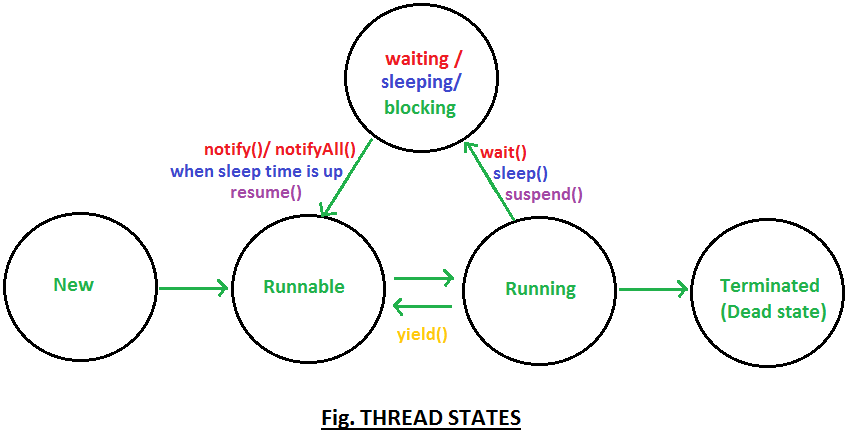
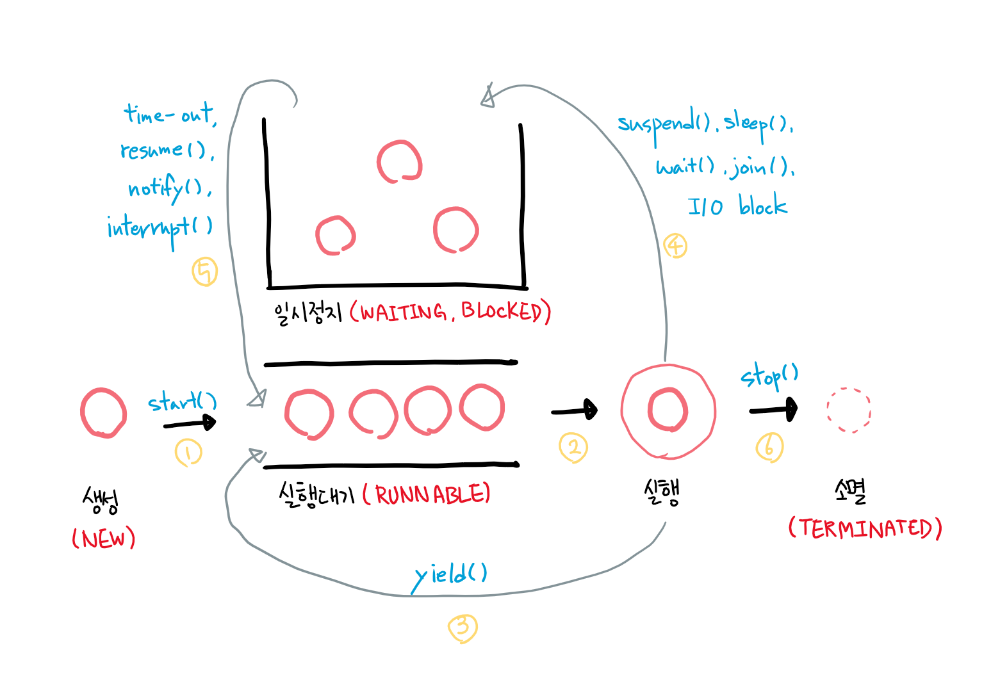

### 멀티쓰레드 프로그래밍

- Thread 클래스와 Runnable 인터페이스
- 쓰레드의 상태
- 쓰레드의 우선순위
- Main 쓰레드
- 동기화
- 데드락

#### Thread 클래스와 Runnable 인터페이스

##### **Process와 Thread의 관계**

###### Process?

- 메모리에 올라와 운영체제로부터 시스템 자원을 할당 받아 실행되고 있는 프로그램의 인스턴스
    - 할당받는 시스템 자원의 예
        - 운영되기 위해 필요한 주소 공간
        - Code, Data, Stack, Heap 구조의 독립된 메모리 영역
- 각각의 프로세스는 독립된 메모리 영역을 할당 받는다.
    - 별도의 주소공간에서 실행되며 한 프로세스는 다른 프로세스의 변수나 자료 구조에 접근 불가하다.
    - 만약 다른 프로세스의 자원에 접근 하려면 프로세스 간의 통신을 사용해야 한다.
        - IPC( Inter Process COmmunication)
        - 파이프, 파일, 소켓 등을 사용한 통신 방법
- 프로세스당 최소 1개의 스레드(메인 스레드)를 가지고 있다.

###### Thread?

- 프로세스 안에서 실제로 작업을 수행하는 주체
- 경량 프로세스라고 불리며 가장 작은 실행 단위
- 프로세스 내에서 각각 Stack만 따로 할당 받고 Code, Data, Heap 영역은 공유한다.
    - 각각의 스레드는 별도의 레지스터와 스택을 갖고 있지만, 힙 메모리는 서로 읽고 쓰기가 가능하다.
    - 한 스레드가 프로세스 자원을 변경하면, 다른 이웃 스레드도 그 변경 결과를 즉시 볼 수 있다.
- 한 프로세스 내에서 동작되는 여러 샐행의 흐름으로, 프로세스 내의 주소 공간이나 자원(Heap영역같은)들을 같은 프로세스 내에 있는 스레드끼리 공유하면서 실행한다.

###### 자바의 Thread

- 일반 스레드와 거의 차이는 없지만 운영체제의 역할을 JVM이 한다.
- 자바에는 프로세스가 존재하지 않고 스레드만 존재.
    - JVM에 의해 스케줄되는 실행 단위 코드 블록
- JVM이 관리하는 정보
    - 존재하는 스레드의 수
    - 스레드로 실행되는 프로그램 코드의 메모리 위치
    - 스레드의 상태
    - 스레드의 우선 순위

###### 멀티 프로세스

- 하나의 응용프로그램을 여러 프로세스로 구성하여 각 프로세스가 하나의 작업을 처리하도록 하는 것
- 여러 자식 프로세스 중 하나에 문제가 발생하면 해당 자식 프로세스만 죽고 다른 영향이 확산되지 않는다.
- 하지만 Context Switching에서의 오버헤드가 발생할 수 있다.
    - **Context Switching** 과정에서 캐시 메모리가 초기화 되는 등의 무거운 작업이 진행되고 많은 시간이 소모되는 등의 오버헤드가 발생한다.
    - 프로세스는 독립된 메모리 영역을 할당 받기 때문에 프로세스 사이에서 공유하는 메모리가 없다. 즉 Context Switching이 발생하면 캐시에 있는 데이터를 리셋후,
      다시 캐시 정보를 불러와야 한다.
- 문맥 교환(Context Switching)
    - CPU에서 여러 프로세스를 돌아가면서 작업을 처리하는 과정
    - 동작중인 프로세스가 대기로 변환할 때 해당 시점의 상태과 데이터를 보관하고 다음 순번의 프로세스가 동작하면서 해당 프로세스의 마지막 상태와 데이터를 복구하여 작업을 이어
      나간다.

###### 멀티 스레드

- 하나의 프로세스를 여러 스레드로 구성, 각 스레드로 하여금 하나의 작업을 처리하도록 하는 것
- 프로세스를 생성하여 자원을 할당하는 시스템 콜이 줄어들어 자원을 효율적으로 관리할 수 있다.
- 스레드 간 데이터를 주고 받는 것이 간단해지고 시스템 자원 소모가 줄어든다.
- 스레드 사이의 작업량이 작기 때문에 멀티 프로세스의 문맥교환보다 멀티 스레드의 문맥 교환이 빠르게 실행된다.
- 스레드는 프로세스 내의 Stack을 제외한 모든 메모리를 공유하기 때문에 통신의 부담이 적다.
- 하지만
    - 주의 깊은 설계
    - 까다로운 디버깅
    - 단일 프로세스 시스템의 경우 효과 미미
    - 프로세스 밖에서 각각의 스레드를 제어할 수 없다.
    - 자원 공유의 동기화 문제가 발생
    - 하나의 스레드에 문제가 생기면 프로세스 전체에 영향을 준다.

###### 멀티 스레드를 선호하는 이유?

- 프로그램을 여러 개 키는 것보다 하나의 프로그램 안에서 여러 작업을 해결하는 것
- 프로세스간의 Context Switching은 단순히 CPU레지스터 교체 뿐만 아니라 RAM과 CPU사이의 캐쉬 메모리에 대한 데이터까지 초기화 되므로 오버헤드가 크다.
- 하지만 스레드 간의 자원 공유는 전역 변수를 이용하므로 함께 사용할 떄 충돌이 발생할 수 있다.

###### Runnable Interface

- 스레드를 생성하는 방법 중 하나
    - Runnable Interface, Thread Class
    - Thread Class는 Runnable Interface를 구현한 클래스
    - 둘 다 java.lang 패키지 안에 포함
- Thread 클래스가 다른 클래스를 확장할 필요가 있는 경우엔 Runnable 구현
- 반대의 상황에선 Thread 클래스

```java
package java.lang;

class Thread implements Runnable {

  private static native void registerNatives();

  static {
    registerNatives();
  }
  //....

  // 추상 메서드인 run()의 body을 만들어주면 된다.
  class MyThread extends Thread {

    @Override
    public void run() {

    } // Thread 클래스의 run()을 오버라이딩
  }
}

```

```java
// 추상 메서드인 run()의 body을 만들어주면 된다.
package java.lang;

@FunctionalInterface
public interface Runnable {

  public abstract void run();
}
```

###### 쓰레드의 동작 순서

- 스레드는 순서대로 실행되지 않으며 매번 결과가 다르다.
- run()메소드가 끝나기 전에는 애플리케이션이 종료되지 않는다.

##### sleep 메소드

- 주어진 시간만큼 대기

###### 쓰레드의 상태

- Thread.State
    - New: 쓰레드가 생성되고 아직 start()가 호출되지 않은 상태
    - Runnable:실행 중 또는 실행 가능한 상태
    - Blocked: 동기화 블럭에 의해서 일시정지된 상태(lock이 풀릴 때까지 기다리는 상태)
    - Waiting, Timed_Waiting: 쓰레드의 작업이 종료되지는 않았지만 실행가능하지 않은(unrunnable) 일시정지 상태 TIMED_WATITING은
      일시정지시간이 지정된 경우를 의미한다.
    - Terminated: 쓰레드의 작업이 종료된 상태
    - 
    - 
        1. 쓰레드를 생성하고 start()를 호출하면 바로 실행되는 것이 아니라 실행대기열에 저장되어 차례를 기다린다. 실행대기열은 Queue와 같은 구조로 먼저
           실행대기열에 들어온 쓰레드가 먼저 실행된다.
        2. 실행대기상태에 있다가 자신의 차례가 되면 실행상태가 된다.
        3. 주어진 실행시간이 다되거나 yield()를 만나면 다시 실행대기상태가 되고 다음 차례의 쓰레드가 실행상태가 된다.
        4. 실행 중에 suspend(), sleep(), wait(), join(), I/O block에 의해 일시정지상태가 될 수 있다. I/O block은
           입출력작업에서 발생하는 지연상태를 말한다.
        5. 지정된 일시정지시간이 다되거나(time-out), notify(), resume(), interrupt()가 호출되면 일시정지상태를 벗어나 다시 실행대기열에
           저장되어 차례를 기다린다.
        6. 실행을 모두 마치거나 stop()이 호출되면 쓰레드는 소멸된다

        - **단, 무조건 번호 순서대로 쓰레드가 수행되는 것은 아니다.**
        -
        출처: [https://yadon079.github.io/2021/java%20study%20halle](https://yadon079.github.io/2021/java%20study%20halle/week-10#thread-%ED%81%B4%EB%9E%98%EC%8A%A4%EC%99%80-runnable-%EC%9D%B8%ED%84%B0%ED%8E%98%EC%9D%B4%EC%8A%A4)

###### 쓰레드의 우선 순위

- Java에서 각 쓰레드는 우선순위에 관한 필드를 가지고 있다.
    - MAX_PRIORITY
    - MIN_PRIORITY
    - NORM_PRIORITY
- 숫자가 높을수록 우선순위가 높아진다.
- 1 부터 10까지의 범위
- 우선순위가 높은 쓰레드는 우선순위가 낮은 쓰레드보다 좀 더 많이 실행 큐에 포함된다.

###### Main Thread

- 자바는 실행 환경이 JVM에서 돌아간다.
- 이것이 하나의 프로세스이고 자바를 실행하기 위해 우리가 실행하는 main()메소드가 메인 쓰레드이다.

###### Daemon Thread
- 멀티태스킹 운영체제에서 데몬(Daemon)은 사용자가 직접 제어하지 않고, 백그라운드에서 돌아가면서 작업을 하는 프로그램을 말한다.
- Main Thread의 작업을 돕는 보조적인 역할을 하는 쓰레드
    - 가비지 컬렉션, 워드의 자동저장등...
- Matin Thread 종료시 자동 종료
- 데몬 쓰레드는 무한 루프와 조건문을 이용해서 실행 후 대기하고 있다가 특정 조건이 만족되면 작업을 수행하고 다시 대기하도록 작성
- 각 쓰레드는 데몬 쓰레드로 마크될 수 있다.
    - 메인 쓰레드는 마크될 수 없다.
        - 데몬으로 마크되기 위해서는 스레드 시작 전에 마크를 해야한다. 하지만 프로그램이 실행되자마자 메인 스레드가 돌기 때문에 메인 쓰레드는 데몬 쓰레드가 될 수 없다.

```
boolean isDaemon() 
: 쓰레드가 데몬 쓰레드인지 확인합니다. 데몬 쓰레드면 ture를 반환합니다.

void setDaemon(boolean on)
: 쓰레드를 데몬 쓰레드로 또는 사용자 쓰레드로 변경합니다.
  ( 매개변수 on의 값 ture로 지정하면 데몬 쓰레드. )
```
```java
import java.util.*;

class example implements Runnable {
  static boolean autoSave = false;
  public static void main(String[] args) {
    Thread t = new Thread(new example());
    t.setDaemon(true); // 이 부분이 없으면 종료되지 않는다.
    // 디폴트: 독립==> setDaemon(true): 데몬쓰레드로 (메인쓰레드 종료시 종속쓰레드는 작업 다 못끝내도 메인 쓰레드와 함께 종료된다.)
    t.start();
    for (int i = 1; i <= 20; i++) {
      try {
        Thread.sleep(1000);
      } catch (InterruptedException e) {
      }
      System.out.println(i);
      if (i == 5)
        autoSave = true;
    }
    System.out.println("프로그램을 종료합니다.");
  }
  
  @Override
  public void run() {
    while (true) {
      try {
        Thread.sleep(3 * 1000);
      } catch (InterruptedException e) {
      }
      if (autoSave)
        autoSave();
    }
  }
  
  private void autoSave() {
    System.out.println("작업파일이 자동저장되었습니다.");
  }
}
```

###### 데몬 쓰레드의 존재 이유
- JVM은 모든 쓰레드가 종료되어야 끝난다. 
- 예를 들어 게임 애플리케이션을 만든다고 하자. 
- 게임 애플리케이션의 메인 스레드는 유저가 종료 버튼을 누르면 종료가 된다.
- 하지만 메인 스레드와 별개로 다른 노멀 스레드로 게임의 중간중간 저장을 한다면 유저가 아무리 종료 버튼을 눌러도 자동저장 스레드 때문에 절대 종료되지 않을것이다.
- 이런 경우에 자동 저장을 데몬 스레드로 만든다.

###### 동기화 (Synchronize)
- 여러 쓰레드가 하나의 리소스를 사용하려도 할 떄 사용 하려는 쓰레드를 제외한 나머지 쓰레드는 접근하지 못하게 막는것
- 공유 자원 접근 순서에 따라 실행 결과가 달라지는 프로그램의 영역을 임계구역(critical section)이라고 함
- 임계구역 해결 조건
  - 상호 배제(mutual exclusion) : 한 쓰레드가 임계구역에 들어가면 다른 쓰레드는 임계구역에 들어갈 수 없습니다. 이것이 지켜지지 않으면 임계구역을 설정한 의미가 없습니다.
  - 한정 대기(bounded waiting) : 한 쓰레드가 계속 자원을 사용하고 있어 다른 쓰레드가 사용하지 못한 채 계속 기다리면 안됩니다. 어떤 쓰레드도 무한 대기(infinite postpone)하지 않아야 합니다. 즉 특정 쓰레드가 임계구역에 진입하지 못하면 안됩니다.
  - 진행의 융통성(progress flexibility) : 한 쓰레드가 다른 쓰레드의 작업을 방해해서는 안됩니다.
- Synchronized: 메소드 전체, 혹은 특정 영역한 임계구역으로 지정
```java
public synchronized void calcSum() {
    ....
}
```
```java
synchronized (객체의 참조변수) {
    ....
}
```
- 전체를 임계구역으로 설정하기 보다는 임계구역을 최소화 할 수 있도록 해야한다.
###### **wait(), notify()**
- 동기화된 임계 영역의 코드를 수행하다가 작업을 더 이상 진행할 상황이 아니면, 일단 wait()을 호출하여 쓰레드가 락을 반납하고 기다리게 한다.
- 다시 진행할 수 있는 상황이 오면 notify()를 호출해 작업을 중단한 쓰레드가 다시 락을 얻는다.
- 다만 가장 오래 기다린 쓰레드가 락을 얻으리란 보장은 없다.
- 쓰레드가 오랫동안 기다리게 되면 이를 기아 현상이라 부른다.
  - 이 현상을 막기 위해 notifyAll()을 사용해야 한다.
  - 다만 이런 경우 다른 쓰레드까지 연락을 받고 불필요한 lock을 얻기 위해 경쟁하게 된다. 이런 경쟁 상태를 개선하기 위해서는 각 스레드를 구별해서 연락하는것이 필요하다.  
  
- Atomic: Wrapping Class의 일종으로 참조타입과 원시타입 두 종류의 변수에 적용 가능
  - 사용시 내부적으로 Compare And Swap 알고리즘을 사용해 lock없이 동기화 처리 가능
  - CAS는 특정 메모리 위치와 주어진 위치의 value를 비교하여 다르면 대체하지 않는다.
  - AtomicBoolean
  - AtomicInteger
  - AtomicLong
  - AtomicIntegerArray
  - AtomicDoubleArray  
- Volatile: 자바 변수를 Memory에 저장하겠다라 명시하는것
  - 매번 변수의 값을 읽을때 CPU cache에 저장된 값이 아닌 Main Memory에서 읽는 것
  - 또한 변수의 값을 write할 때 Main Memory까지 작성한다
  - 멀티 쓰레드 환경에서는 작업을 수행하는 동안 성능 향승을 위해 Main Memory에서 읽은 변수를 CPU cache에 저장하게 되는데 <br/> 쓰레드가 변수 값을 읽어올 떄 각각의 CPU cache에 저장된 값이 달라 문제가 발생한다.
  - 즉 멀티 스레드 환경에서 하나의 쓰레드만 읽고 쓰기가 가능하고 나머지 쓰레드는 읽기만 가능한 경우 가장 최신의 값을 보장한다.  
    
###### 데드락
- 두 개 이상의 작업이 서로 상대방의 작업이 끝나기를 기다리기만 하고 작업이 완료되지 못하는 상태
- 둘 이상의 쓰레드가 lock을 획득하기 위해 대기중에 해당 lock을 보유한 다른 쓰레드 역시 다른 lock을 기다리며 block 상태에 놓이는 것
- 다수의 쓰레드가 같은 lock을 동시에 다른 명령에 의해 획득하려 할 때 발생
###### 교착 상태의 발생 원인
1. 상호 배제: 자원이 임계구역에서 보호되고 있다면 쓰레드끼리 동시에 사용할 수 없고 교착상태에 빠진다.
2. 비선점: 자원을 얻기위해 다른 쓰레드가 해당 자원을 놓아줄때까지 기다려야 하고 교착상태에 빠진다.
3. 점유와 대기: 이미 자원 하나를 사용하고 있는 중에 다른 자원을 기다리게 되면 소유중인 자원을 기다리는 다른 쓰레드가 발생하고 교착상태에 빠진다.
4. 원형 대기: 자원을 요구하는 방향이 원을 이루면 서로 양보를 하지 않기에 교착상태에 빠진다.

###### 예방
- 상호 배제 조건의 제거: 공유 불가능한 자원을 제거, 공유 가능토록 한다?
- 점유와 대기 조건 제거: 한 프로세스에 수행되기 전에 모든 자원을 할당시키고 점유하지 않을떄는 다른 프로세스가 자원을 요구하도록 한다.
- 비선점 조건 제거: 선점 가능한 프로토콜을 만들어 준다.
- 원형 대기 조건의 제거: 자원 유형에 따라 순서를 매긴다.
- **자원사용 효율이 떨어지고 비용도 높다**
###### 회피
- 자원이 어떻게 요청될지에 대한 추가정보를 제공하도록 요구한다.
1. 자원 할당 그래프 알고리즘: 자원이 하나일 때 사용하는 알고리즘. 자원 할당 그래프에 요청 간선과 할당 간선에 추가하여, 예약간선이라는 새로운 유형의 간선을 도입
2. 은행원 알고리즘: 안전상태를 유지할 수 있는 요구만을 수락, 불안전 상태를 초래한 사용자의 요구는 나중에 만족될 수 있을때까지 거절
- [출처](https://wannabe-gosu.tistory.com/26)
###### 무시
- 예방과 회피방법을 활용하면 성능 상 이슈가 발생하는데, 데드락 발생에 대한 상황을 고려하는 것에 대한 비용이 낮다면 별다른 조치를 하지 않을 수도 있다고 한다.

#### synchronized vs Lock
- 공정성의 차이
- 공정성이란 모든 쓰레드가 자신의 작업을 수행할 동일한 기회를 가지는 것
- Queue안에서 쓰레드들이 **무조건** 순서를 지키며 lock을 확보
- synchronized는 공정성을 제공하지 않는다.
- ReetrantLock은 생성자의 인자를 통해 공정성 Fair/NotFair를 설정 가능
```java
public ReentrantLock() {
  sync = new NonFairSync();
}

public ReentrantLock(boolean fair) {
  sync = fair ? new FairSync() : new NonFairSync();
}
```
- 공정한 lock은 가장 오래 기다린 쓰레드에게 lock을 제공한다.
- 하지만 락 요청 시간이 긴 경우가 아니라면 불공정한 편이 성능적으로 더 좋다.

###### ConcurrentHashMap
###### lock Striping
