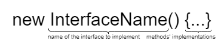
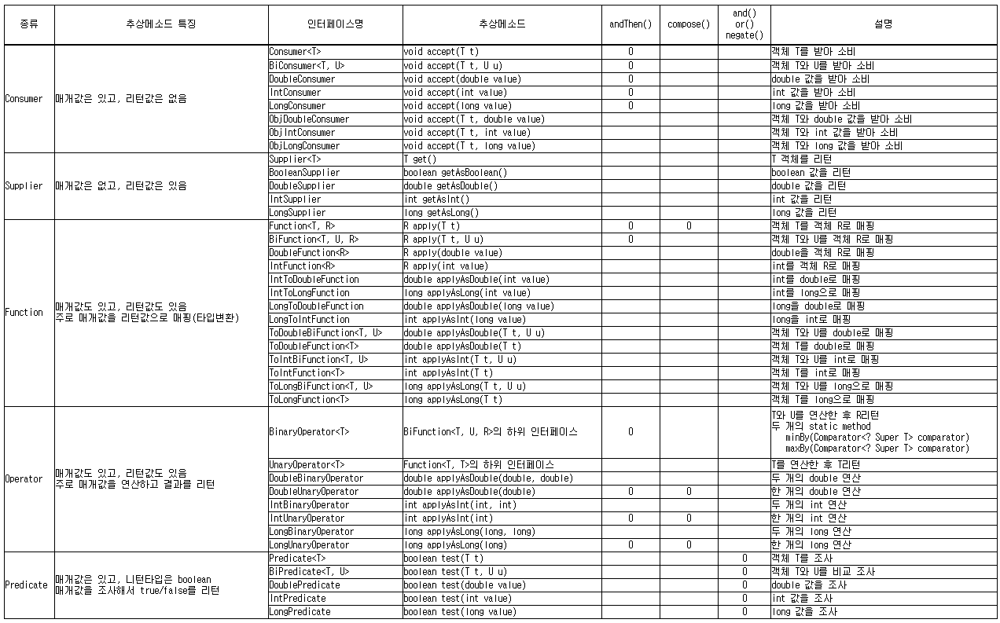

## 람다 표현식

##### 익명 구현 객체란 무엇인가
- 익명 구현 객체란 이름이 없는 내부 클래스이며 이름이 없기 때문에 인스턴스를 생성할 수 없다.
  - 그렇기 때문에 익명 구현 객체는 사용시점에 단일 표현식으로 익명 클래스를 선언하고 인스턴스화해야한다.
  

- 이미 존재하는 클래스로부터 익명 구현 객체 생성하는 방법
- 
```java
new Book("Design Patterns") {
    @Override
    public String description() {
        return "Famous GoF book.";
    }
}
```    

- 이미 존재하는 인터페이스로부터 익명 구현 객체 생성하는 방법
- 
- **자바 인터페이스에는 생성자가 없다**
```java
new Runnable() {
    @Override
    public void run() {
        ...
    }
}
```
- 익명 클래스를 인스턴스화하면 나중에 어딘가에서 참조 할 수 있도록 다음과 같이 해당 인스턴스를 변수에 할당 할 수 있다.
```java
Runnable action = new Runnable() {
    @Override
    public void run() {
        ...
    }
};
```
- **익명 클래스 선언은 표현식이므로 명령문의 일부이다. 그렇기에 문장 끝에 세미콜론을 붙여줘야 한다.**

##### 람다식이란 무엇인가
- 식별자 없이 실행 가능한 함수이며 메소드를 하나의 식으로 표현한 것
- 익명 클래스를 좀 더 보기 편하게 작성할 수 있도록 도와준다.
- **A lambda expression is a short form for writing an anonymous class. By using a lambda expression, we can declare methods without any name.**  
  - 하지만 내부적으로 동작하는 방식이 다르다
    - 아마 이 이유때문에 람다를 익명클래스로 볼것인지 아닌지에 대한 토론이 일어난듯?
###### 차이점
1. 익명 클래스는 컴파일이 된 후 별도의 클래스 파일을 생성하지만 람다식은 private method로 변환된다.
   - 람다식은 **invokedynamic bytecode** 를 사용하여 생성된 메서드를 동적으로 바인딩 하여 시간과 메모리를 절약한다.
2. this 키워드를 사용하면 람다 식은 현재 클래스를 나타내지만 익명 클래스의 경우 this 키워드는 해당 익명 클래스를 나타낸다.
3. 람다식은 함수의 body만 제공하면 되지만 익명 클래스는 redundant class definition을 작성해야한다.

###### 함수형 인터페이스 먼저 알아보자
- 추상 메소드가 하나뿐인 인터페이스를 함수형 인터페이스라고 한다.
```java
public class Exam_003 {
}
 
interface FunctionalInterface_001 {
    void aaa();
}
 
// 함수형 인터페이스는 @FunctionalInterface 를 사용해서 명시적으로 컴파일러에게 알려줄 수 있다.
// @FunctionalInterface 를 사용하면 다른 사람이 추상 메소드를 추가하는 상황을 예방할 수 있다.
@FunctionalInterface
interface FunctionalInterface_002 {
    void aaa();
    
    // static 메소드가 있어도 괜찮다.
    static void bbb() { }
    
    // default 메소드가 있어도 괜찮다.
    default void ccc() { }
}

```
- 두개의 인터페이스의 특징은 인터페이스를 상속 받은 클래스가 반드시 구현해야하는 추상 메소드가 한 개 뿐이라는 것
-  @FunctionalInterface 라는 애노테이션을 붙여줄 수 있다.
  - 이 애노테이션을 붙이면 컴파일러가 해당 인터페이스에 추상 메소드가 1개만 선언 되었는지 확인해준다.

###### 람다식 작성
- 화살표를 기준으로 좌측에 매개변수가 우측에 실행 코드가 작성 된다.
```java
public class Exam_004 {
    public static void main(String[] args) {
        
        // 1. 작성 가능한 모든 내용을 생략 없이 작성한 경우
        LambdaTest_001 myTest_01 = (String param) -> {
            System.out.println(param);
        };
        
        // 2. 매개변수의 타입을 생략한 경우
        LambdaTest_001 myTest_02 = (param) -> {
            System.out.println(param);
        };
        
        // 3. 매개변수가 한개여서 소괄호를 생략한 경우
        LambdaTest_001 myTest_03 = param -> {
            System.out.println(param);
        };
        
        // 4. 실행 코드가 한 줄이어서 중괄호를 생략한 경우
        LambdaTest_001 myTest_04 = (String param) -> System.out.println(param);
        
        // 5. 매개변수가 한개이고 실행 코드가 한 줄이어서 생략 가능한 모든것을 생략한 경우
        LambdaTest_001 myTest_05 = param -> System.out.println(param);
        
        // 6. 반환값이 있는 경우 return 키워드 사용하는 경우
        LambdaTest_002 myTest_06 = (n1, n2) -> {
            System.out.println("6. 반환값이 있는 경우 return 키워드 사용하는 경우");
            return n1 + n2;
        };
    
        // 7. 실행 코드가 반환 코드만 존재하는 경우 키워드와 중괄호 생략한 경우
        LambdaTest_002 myTest_07 = (n1, n2) -> n1 + n2;
        
        // 8. 매개변수가 없어서 소괄호를 생략할 수 없는 경우
        LambdaTest_003 myTest_08 = () -> System.out.println("8. 매개변수가 없어서 소괄호를 생략할 수 없는 경우");
        
        myTest_01.printString("1. 작성 가능한 모든 내용을 생략 없이 작성한 경우");
        myTest_02.printString("2. 매개변수의 타입을 생략한 경우");
        myTest_03.printString("3. 매개변수가 한개여서 소괄호를 생략한 경우");
        myTest_04.printString("4. 실행 코드가 한 줄이어서 중괄호를 생략한 경우");
        myTest_05.printString("5. 매개변수가 한개이고 실행 코드가 한 줄이어서 생략 가능한 모든것을 생략한 경우");
        
        System.out.println();
        System.out.println(myTest_06.add(10, 20));
        System.out.println(myTest_07.add(20, 30));
    
        myTest_08.noArgs();
    }
}
 
@FunctionalInterface
interface LambdaTest_001 {
    void printString(String str);
}
 
@FunctionalInterface
interface LambdaTest_002 {
    int add(int num1, int num2);
}
 
@FunctionalInterface
interface LambdaTest_003 {
    void noArgs();
}
```
```text
1. 작성 가능한 모든 내용을 생략 없이 작성한 경우

2. 매개변수의 타입을 생략한 경우

3. 매개변수가 한개여서 소괄호를 생략한 경우

4. 실행 코드가 한 줄이어서 중괄호를 생략한 경우

5. 매개변수가 한개이고 실행 코드가 한 줄이어서 생략 가능한 모든것을 생략한 경우


6. 반환값이 있는 경우 return 키워드 사용하는 경우

30

50

8. 매개변수가 없어서 소괄호를 생략할 수 없는 경우
```
- 출처:https://blog.naver.com/hsm622/222260183401

###### 타겟 타입
- 람다식을 사용할 때 타겟 타입 이라는 것이 존재한다.
- 람다식은 기본적으로 '인터페이스 변수'에 담기는데, 이 람다식이 담기는 인터페이스를 타겟 타입이라고 한다.
- 위에 작성한 예제 코드 기준으로 LambdaTest_001 과 LambdaTest_002 를 타겟 타입이라고 할 수 있다.
- 람다식만 보고는 이게 어떤 함수형 인터페이스를 구현한 것인지 유추할 수 없기 때문에 타겟 타입이 중요하다.


- 람다 관련 자바 표준 API
- 

#### Variable Capture
- 람다식의 실행 코드 블록 내에서 클래스의 멤버 필드와 멤버 메소드, 그리고 지역 변수를 사용할 수 있다.
- 클래스의 멤버 필드와 멤버 메소드는 특별한 제약 없이 사용 가능하지만, 지역변수를 사용함에 있어서는 제약이 존재한다.

- 멤버 메소드 내부에서 클래스의 객체를 생성해서 사용 할 경우 다음과 같은 문제가 있다.


- 익명 구현 객체를 포함해서 객체를 생성 할 경우 new 라는 키워드를 사용 하는데 이 키워드를 사용한다는 것은 동적 메모리 할당 영역(이하 heap)에 객체를 생성한다는 것을 의미한다.
- 이렇게 생성된 객체는 자신을 감싸고 있는 멤버 메소드의 실행이 끝난 이후에도 heap 영역에 존재하므로 사용할 수 있지만 <br/> 이 멤버 메소드에 정의 된 매개변수나 지역 변수는 런타임 스택 영역(이하 stack)에 할당되어 메소드 실행이 끝나면 <br/> 해당 영역에서 사라져 더 이상 사용할 수 없게 된다.
- 그렇기 때문에 멤버 메소드 내부에서 생성된 객체가 자신을 감싸고 있는 메소드의 매개변수나 지역변수를 사용하려 할 때 문제가 생길 수 있다.

1. 클래스의 멤버 메소드의 매개변수와 이 메소드 실행 블록 내부의 지역 변수는 JVM의 stack에 생성되고 메소드 실행이 끝나면 stack에서 사라진다.

2. new 연산자를 사용해서 생성한 객체는 JVM의 heap 영역에 객체가 생성되고 GC (Garbage Collector)에 의해 관리되며, 더 이상 사용하지 않는 객체에 대해 필요한 경우 메모리에서 제거한다.

- heap에 생성된 객체가 stack의 변수를 사용하려고 하는데, 사용하려는 시점에 stack에 더 이상 해당 변수가 존재하지 않을 수 있다. 왜냐하면 stack은 메소드 실행이 끝나면 매개변수나 지역변수에 대해 제거하기 때문이다. 그래서 더 이상 존재하지 않는 변수를 사용하려 할 수 있기 때문에 오류가 발생한다.

- 자바는 이 문제를 Variable Capture 라고 하는 값 복사를 사용해서 해결하고 있다.

- 즉, 컴파일 시점에 멤버 메소드의 매개변수나 지역 변수를 멤버 메소드 내부에서 생성한 객체가 사용 할 경우 객체 내부로 값을 복사해서 사용한다. 하지만 모든 값을 복사해서 사용할 수 있는 것은 아니다.
  - 여기에도 제약이 존재하는데 final 키워드로 작성 되었거나 final 성격을 가져야 한다.

- final 키워드로 작성 되는 것은 알겠는데, 성격을 가진다는 것은 무엇일까.
- final 성격을 가진다는 것은 final 키워드로 선언된 것은 아니지만 ​값이 한 번만 할당 되어​ final 처럼 쓰이는 것을 뜻한다.
  - (java 1.7 까지는 final 을 반드시 명시 했어야 했고, final 을 생략하고 쓸 수 있는 건 java 1.8 부터로 기억한다.)
- final 키워드의 유무에 따라 복사 위치가 달라진다고 한다.


###### 메소드, 생성자 레퍼런스

- 메소드, 생성자 레퍼런스는 람다식을 더 간략하게 표현할 수 있게 해준다.

- 콜론 두 개 :: 를 사용하며, 크게 다음과 같이 구분할 수 있다.

1. static 메소드 참조 : 클래스_이름::메소드_이름

2. 인스턴스 메소드 참조 : 인스턴스_변수::메소드_이름

3. 람다식의 매개변수로 접근 가능한 메소드 참조 : 매개변수의_타입_클래스_이름::메소드_이름

4. 생성자 참조 :  클래스_이름::new


- 1, 2, 3번에 해당하는 예제
```java
import java.util.function.BiFunction;
import java.util.function.IntBinaryOperator;
import java.util.function.ToIntBiFunction;
 
public class Exam_006 {
    public static void main(String[] args) {
        
        // int 타입 두 개를 받아 int 타입을 반환하는 표준 api 사용
        IntBinaryOperator op;
        
        // static method 참조
        op = (num_01, num_02) -> MyReference.add_static(num_01, num_02);
        System.out.println(op.applyAsInt(10, 20));
    
        op = MyReference::add_static;
        System.out.println(op.applyAsInt(20, 30));
        
        
        // instance method 잠조
        MyReference mr = new MyReference();
        
        op = (num_01, num_02) -> mr.add_instance(num_01, num_02);
        System.out.println(op.applyAsInt(30, 40));
        
        op = mr::add_instance;
        System.out.println(op.applyAsInt(40, 50));
        
        // 람다식의 매개변수로 접근 가능한 메소드 참조
        //
        // 만약 (x, y) -> x.instanceMethod(y) 인 경우가 있는데
        // 이런 경우 사용할 수 있는 방법은 아래와 같다.
        //
        // 아래 코드는 x 문자열에 y 문자열이 포함되어 있는지 결과를 반환하는 예제이다.
        // String 클래스의 contains 를 사용 한다.
        //
        // 이 경우 static method 참조와 형태가 매우 유사해 보이지만
        // x의 타입에 속하는 클래스 다음에 :: 연산자를 사용해서 메소드 참조를 한다.
        BiFunction<String, String, Boolean> myBiFunction;
        myBiFunction = (x, y) -> x.contains(y);
        System.out.println(myBiFunction.apply("java study", "java"));
        
        myBiFunction = String::contains;
        System.out.println(myBiFunction.apply("java online study", "python"));
    }
}
 
class MyReference {
    // static method
    public static int add_static(int num_1, int num_2) {
        return num_1 + num_2;
    }
    
    // instance method
    public int add_instance(int num_1, int num_2) {
        return num_1 + num_2;
    }
}
```
```text
30

50

70

90

true

false
```

- 생성자 참조 예제
```java
import java.util.function.BiFunction;
import java.util.function.Function;
import java.util.function.Supplier;
 
public class Exam_007 {
    public static void main(String[] args) {
        
        BiFunction<String, Integer, ConstructorRefTest> bf;
        Function<String, ConstructorRefTest> f;
        Supplier<ConstructorRefTest> s;
        
        bf = (param_1, param_2) -> new ConstructorRefTest(param_1, param_2);
        System.out.println(bf.apply("nimkoes", 17).toString());
    
        System.out.println();
        
        s = ConstructorRefTest::new;
        System.out.println("기본 생성자 : " + s.get().toString());
        
        f = ConstructorRefTest::new;
        System.out.println("String 하나를 받는 생성자 : " + f.apply("nimkoes").toString());
        
        bf = ConstructorRefTest::new;
        System.out.println("String, int 두 개를 받는 생성자 : " + bf.apply("xxxelppa", 71).toString());
        
    }
}
 
class ConstructorRefTest {
    String name;
    int age;
    
    public ConstructorRefTest() {
    }
    
    public ConstructorRefTest(String name) {
        this.name = name;
    }
    
    public ConstructorRefTest(String name, int age) {
        this.name = name;
        this.age = age;
    }
    
    @Override
    public String toString() {
        return "ConstructorRefTest{" +
                "name='" + name + '\'' +
                ", age=" + age +
                '}';
    }
}

```
```text
ConstructorRefTest{name='nimkoes', age=17}

기본 생성자 : ConstructorRefTest{name='null', age=0}

String 하나를 받는 생성자 : ConstructorRefTest{name='nimkoes', age=0}

String, int 두 개를 받는 생성자 : ConstructorRefTest{name='xxxelppa', age=71}
```


